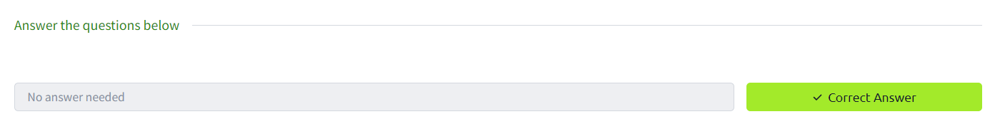
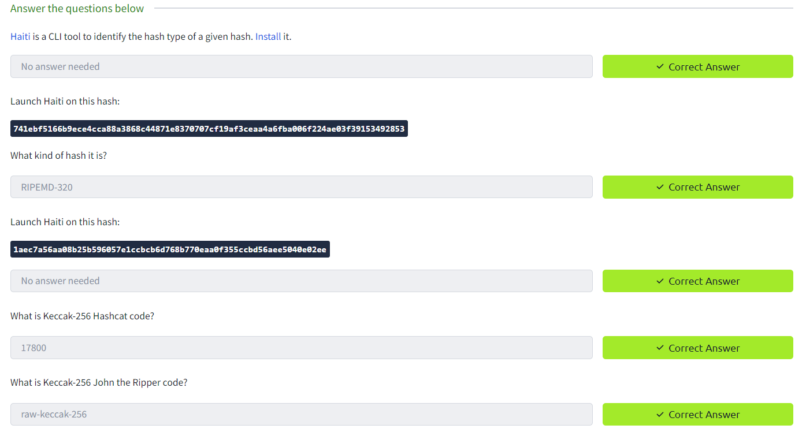
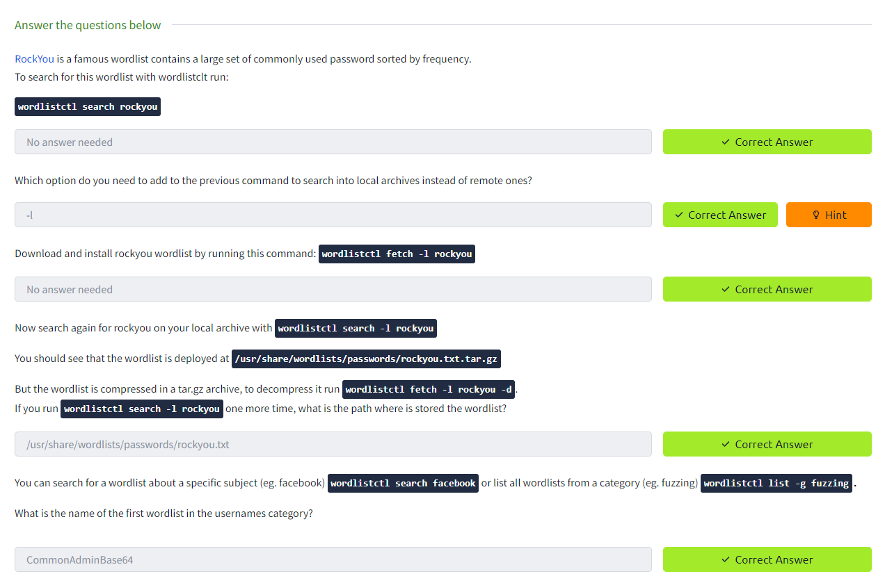
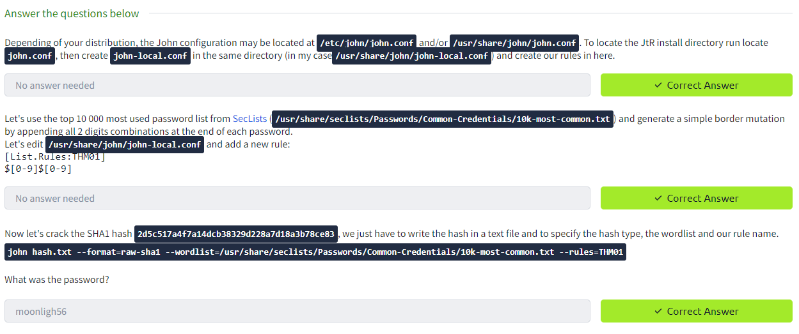
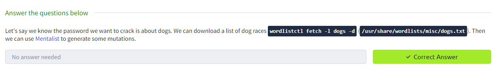
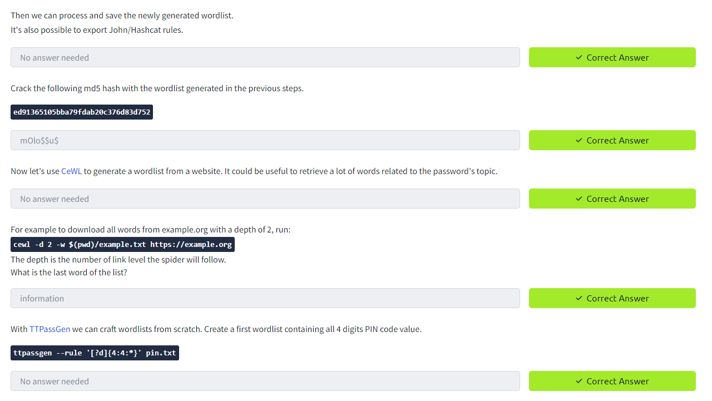
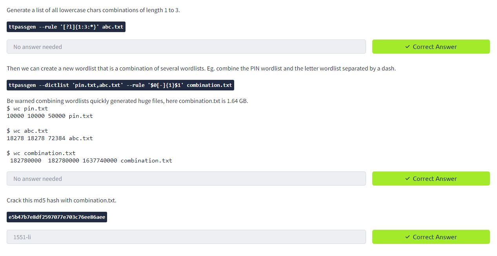
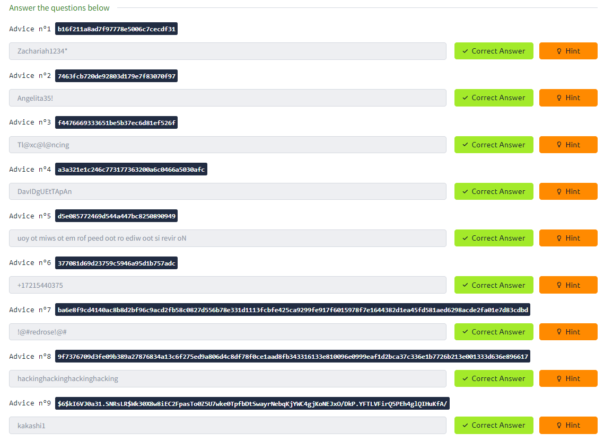
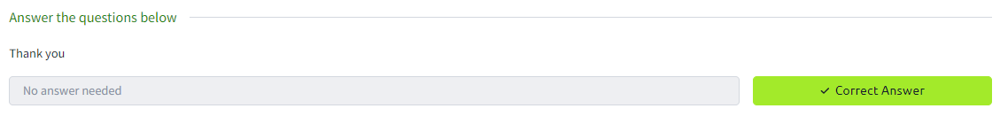

Task 1 Info Introduction

Task 2 Walkthrough Hash identification

Task 3 Walkthrough Wordlists

Task 4 Walkthrough Cracking tools, modes & rules

Task 5 Walkthrough Custom wordlist generation

Task 6 Challenge It's time to crack hashes

Task 7 Info About the author
