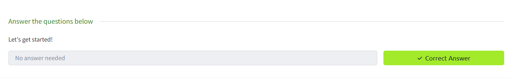
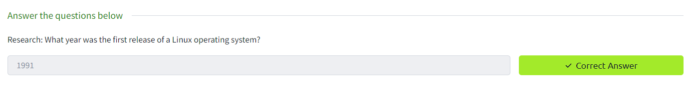
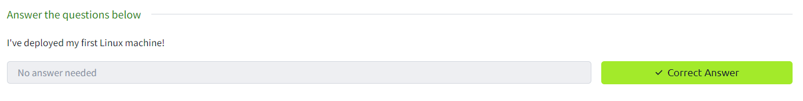
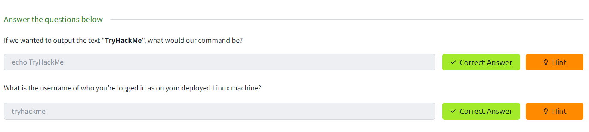
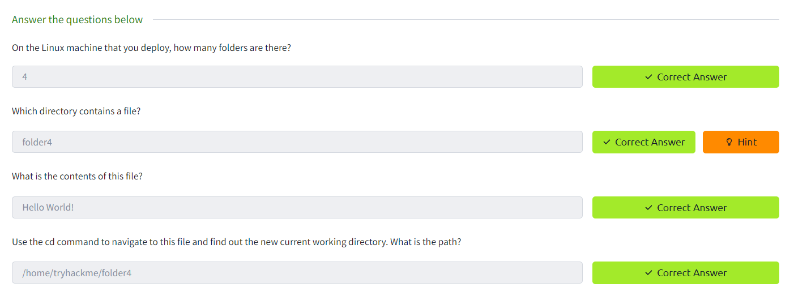
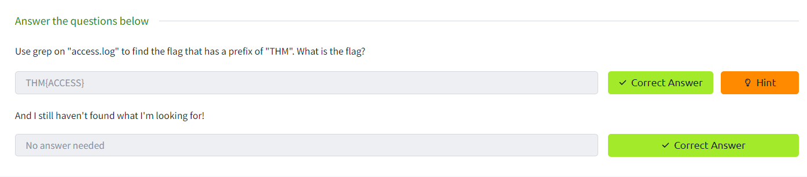
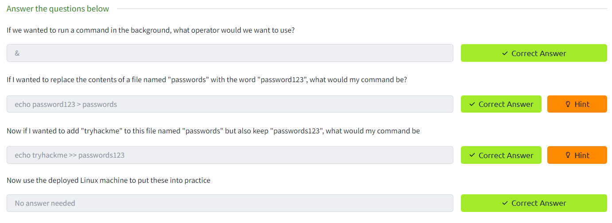
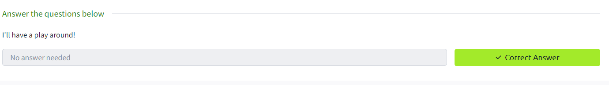
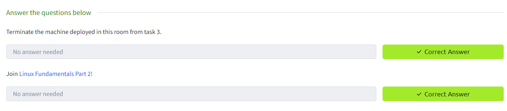

Task 1 Introduction

Task 2 A Bit of Background on Linux

Task 3 Interacting With Your First Linux Machine (In-Browser)

Task 4 Running Your First few Commands

Task 5 Interacting With the Filesystem!

Task 6 Searching for Files

Task 7 An Introduction to Shell Operators

Task 8 Conclusions & Summaries

Task 9 Linux Fundamentals Part 2
