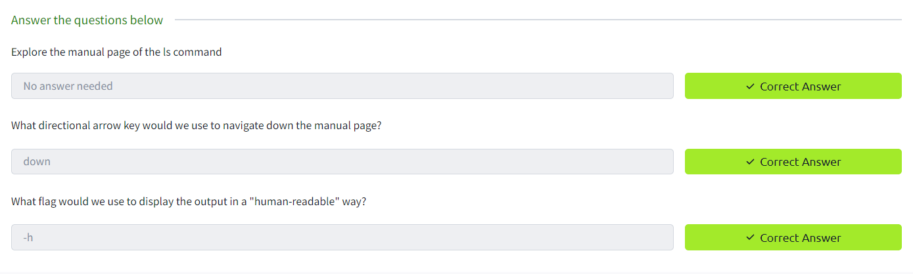

Task 1 Introduction

Task 2 Accessing Your Linux Machine Using SSH (Deploy)

Task 3 Introduction to Flags and Switches

Task 4 Filesystem Interaction Continued

Task 5 Permissions 101

Task 6 Common Directories

Task 7 Conclusions and Summaries

Task 8 Linux Fundamentals Part 3
