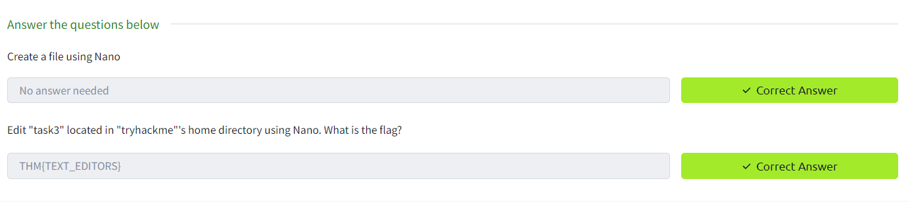

Task 1 Introduction

Task 2 Deploy Your Linux Machine

Task 3 Terminal Text Editors

Task 4 General/Useful Utilities

Task 5 Processes 101

Task 6 Maintaining Your System: Automation

Task 7 Maintaining Your System: Package Management

Task 8 Maintaining Your System: Logs

Task 9 Conclusions & Summaries\
