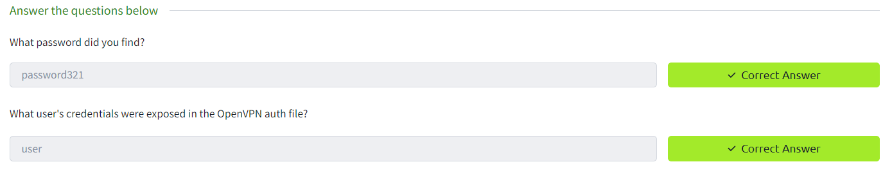

Task 1 [Optional] Connecting to the TryHackMe network

Task 2 Deploy the vulnerable machine

Task 3 Privilege Escalation - Kernel Exploits

Task 4 Privilege Escalation - Stored Passwords (Config Files)

Task 5 Privilege Escalation - Stored Passwords (History)

Task 6 Privilege Escalation - Weak File Permissions

Task 7 Privilege Escalation - SSH Keys

Task 8 Privilege Escalation - Sudo (Shell Escaping)

Task 9 Privilege Escalation - Sudo (Abusing Intended Functionality)

Task 10 Privilege Escalation - Sudo (LD_PRELOAD)

Task 11 Privilege Escalation - SUID (Shared Object Injection)

Task 12 Privilege Escalation - SUID (Symlinks)

Task 13 Privilege Escalation - SUID (Environment Variables #1)

Task 14 Privilege Escalation - SUID (Environment Variables #2)

Task 15 Privilege Escalation - Capabilities

Task 16 Privilege Escalation - Cron (Path)

Task 17 Privilege Escalation - Cron (Wildcards)

Task 18 Privilege Escalation - Cron (File Overwrite)

Task 19 Privilege Escalation - NFS Root Squashing
