Task 1 Introduction
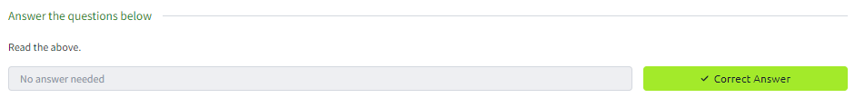
Task 2 What is Privilege Escalation?

Task 3 Enumeration
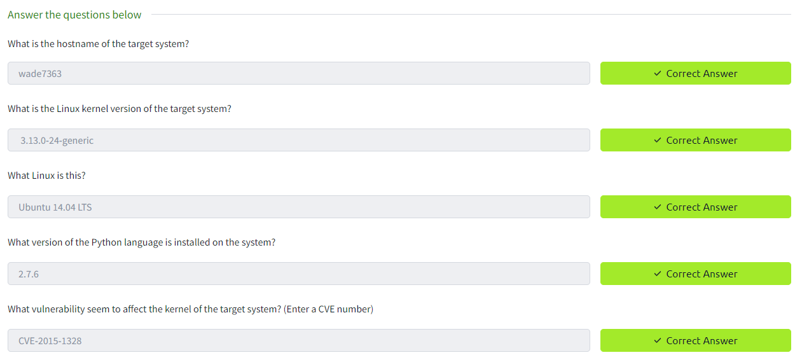
Task 4 Automated Enumeration Tools
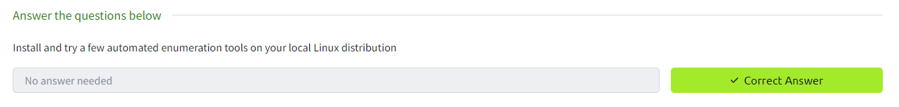
Task 5 Privilege Escalation: Kernel Exploits
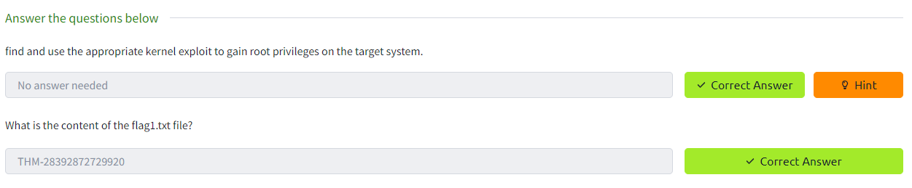
Task 6 Privilege Escalation: Sudo
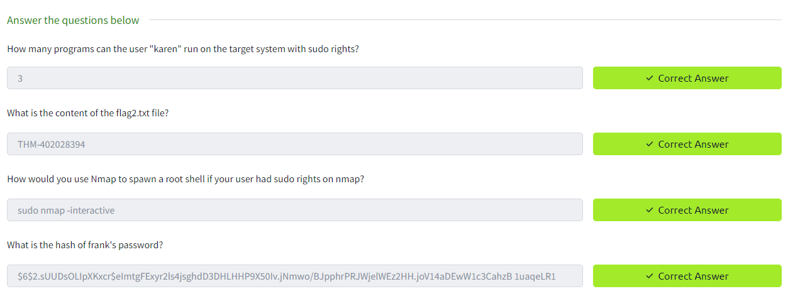
Task 7 Privilege Escalation: SUID
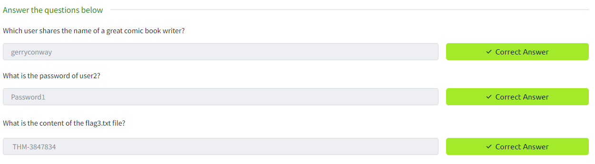
Task 8 Privilege Escalation: Capabilities
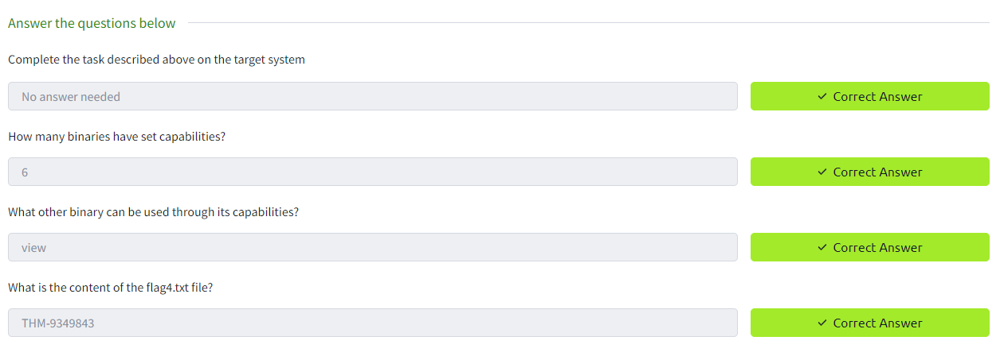
Task 9 Privilege Escalation: Cron Jobs
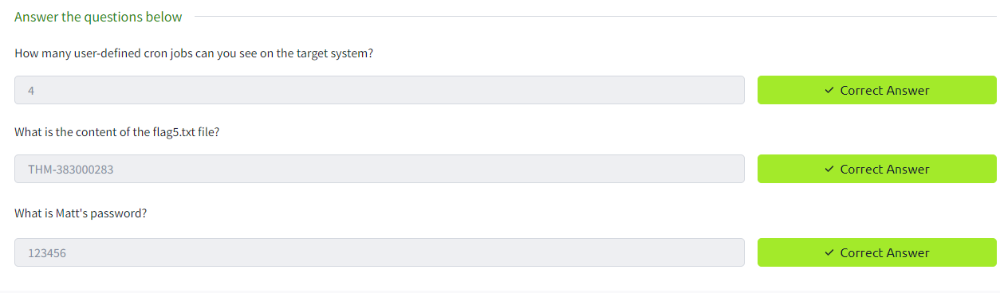
Task 10 Privilege Escalation: PATH
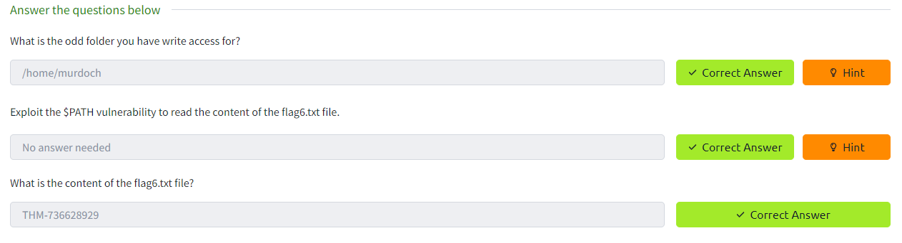
Task 11 Privilege Escalation: NFS
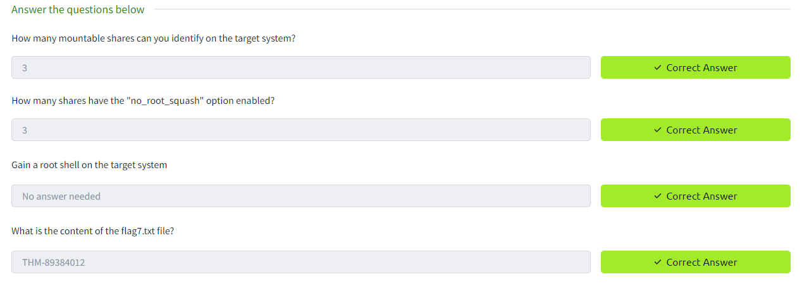
Task 12 Capstone Challenge
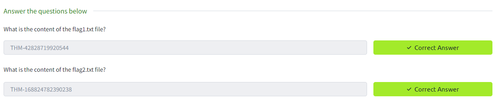