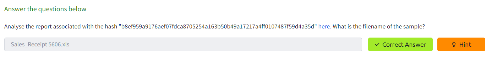
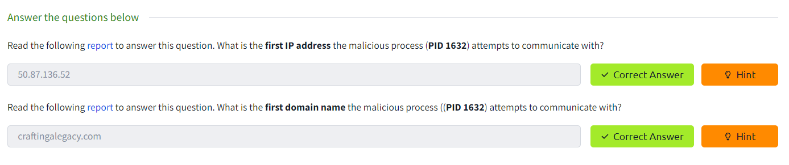
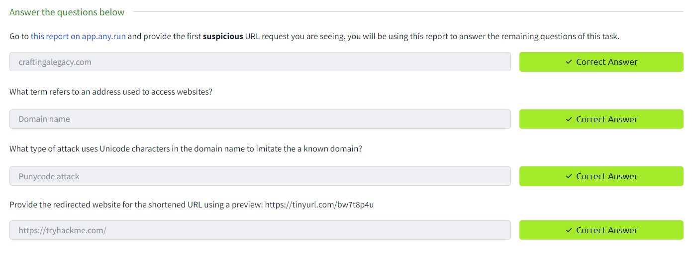
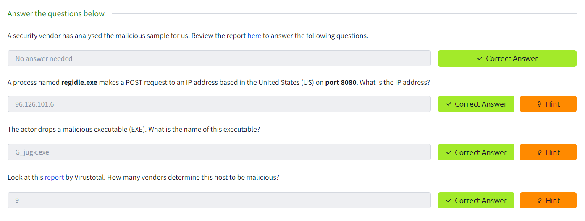
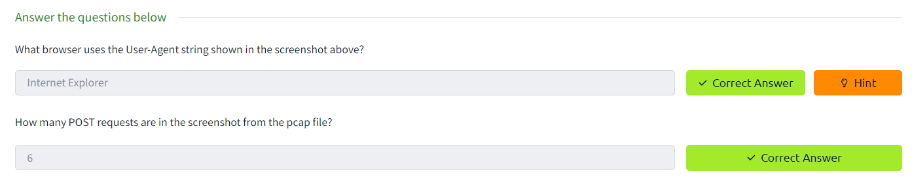
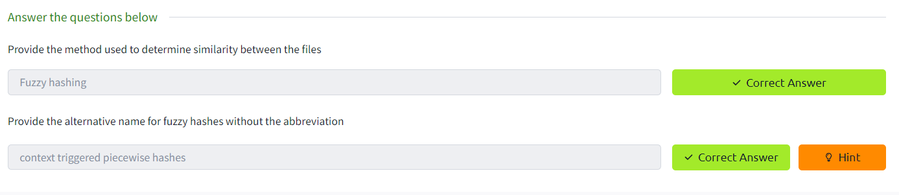
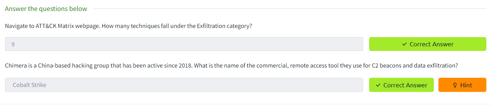
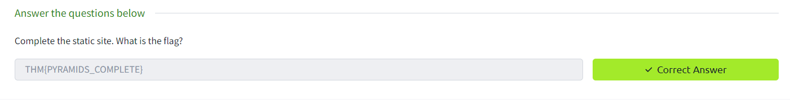

Task 1 Introduction

Task 2 Hash Values (Trivial)

Task 3 IP Address (Easy)

Task 4 Domain Names (Simple)

Task 5 Host Artifacts (Annoying)

Task 6 Network Artifacts (Annoying)

Task 7 Tools (Challenging)

Task 8 TTPs (Tough)

Task 9 Practical: The Pyramid of Pain

Task 10 Conclusion
